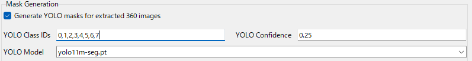
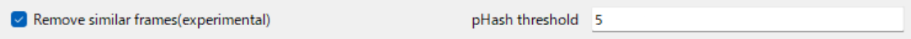
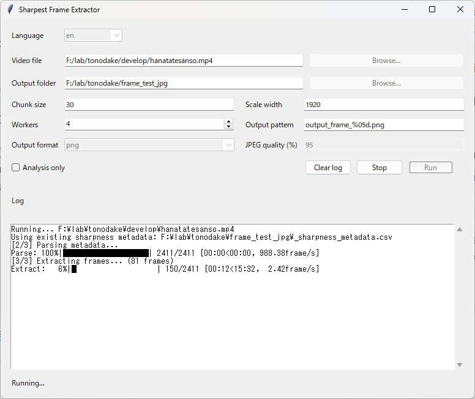

# Extract Sharpest Frame

Python-only tool for extracting sharp frames from a video.

This repository provides two entry points:

- `extract_sharpest_frame.py`: command-line interface
- `extract_sharpest_frame_gui.py`: desktop GUI with Japanese/English switching

The implementation uses OpenCV to read video frames, calculates sharpness with the variance of the Laplacian, groups frames by chunk, and saves the sharpest frame from each chunk as a JPEG or PNG.

---
**Windows binary edition with GUI is sold on BOOTH. No need python command and easy to run!**
- [Promotion] https://kotohibi.f5.si/360/
- [BOOTH URL] https://kotohibi-cg.booth.pm/ 
  - Only binary edition can support the following features
    - Generating masks by YOLO automatically (person, car, bus, etc...)
      - More accurate SfM for Metashape and others
      - 
    - Faster frame extraction (Multi process optimization)
    - V0.4.0 (2026-04-02)
      - Exclude similar frames. This is useful when movement speed during shooting is irregular.
      - 
      - https://x.com/kotohibi_3d/status/2039716550194950248
    - V0.5.0 (2026-04-06)
      - Custom mask, video range, save and load config
      - https://x.com/kotohibi_3d/status/2041150636797092322
    - V0.6.0 (2026-04-21)
      - Added mask only mode for still images
      - Able to review and adjust the effect of eliminating similar frames before execution.
      - https://x.com/kotohibi_3d/status/2046282840883826952
    - V0.7.0 (2026-05-24)
      - SAM3 text prompt masking
      - SAM3 is very powerful for masking but needs PC resource so please check the readme in the zip.
      - https://x.com/kotohibi_3d/status/2058304471759986983
    - V0.8.0 (2026-06-10)
      - Batch process supported for multiple videos. You no longer need to process one by one video.
      - Some GUI improvements
      - https://x.com/kotohibi_3d/status/2064662878054166531
    - V0.8.5 (2026-06-28)
      - Selectable image size for inputting SAM3
      - Able to specify confidence value for SAM3
      - https://x.com/kotohibi_3d/status/2071208324352331931
    - V0.9.0 (2026-07-05)
      - SAM3 dual masking (See comment for details) 
      - Some improvements in SAM3 preview dialog
      - https://x.com/kotohibi_3d/status/2073433180712157185
    - V1.0.0 (2026-08-01)
      - It embeds preset seam masks to reduce stitch line error for OSMO360 and AVATA360
      - Some bug fixes
      - https://x.com/kotohibi_3d/status/2083478237402038391

---
Refer to the detail workflow  
- [[English]Easy&Fast 3D Gaussian Splatting workflow with 360 Camera](https://zenn.dev/kotohibi/articles/409bc16876b9e0)
- [[日本語]Easy&Fast 3D Gaussian Splatting workflow with 360 Camera](https://zenn.dev/kotohibi/articles/28b137f1873921)


## Features

- 100% Python workflow with no `ffmpeg` executable dependency
- Extract one sharp frame per chunk with `--chunk-size`
- Multiprocess metadata extraction with configurable worker count
- Reuse existing `_sharpness_metadata.csv` when available
- Regenerate metadata when needed
- `--analysis-only` mode for metadata creation only
- GUI with English/Japanese switching
- GUI confirmation dialog when metadata already exists
- GUI stop button for cancelling a running job
- `tqdm`-style progress output in the GUI log area

## GUI



## Requirements

- Python 3.8+
- Packages from `requirements.txt`

Current Python dependencies:

- `opencv-python`
- `tqdm`

`extract_sharpest_frame_gui.py` uses Tkinter, which is included with standard desktop Python installations in most environments.

## Installation

Clone the repository:

```bash
git clone https://github.com/Kotohibi/Extract_sharpest_frame.git
cd Extract_sharpest_frame
pip install -r requirements.txt
```

## CLI Usage

Basic example:

```bash
python extract_sharpest_frame.py --video /path/to/video.mp4
```

Windows PowerShell example:

```powershell
python .\extract_sharpest_frame.py --video C:\path\to\video.mp4
```

Save output to a custom folder:

```bash
python extract_sharpest_frame.py \
  --video /path/to/video.mp4 \
  --output-dir ./sharp_frames
```

Extract one frame every 30 frames:

```bash
python extract_sharpest_frame.py \
  --video /path/to/video.mp4 \
  --chunk-size 30
```

Analyze metadata with 4 workers:

```bash
python extract_sharpest_frame.py \
  --video /path/to/video.mp4 \
  --workers 4
```

Create metadata only:

```bash
python extract_sharpest_frame.py \
  --video /path/to/video.mp4 \
  --output-dir ./sharp_frames \
  --analysis-only
```

## GUI Usage

Start the GUI:

```bash
python extract_sharpest_frame_gui.py
```

Windows PowerShell example:

```powershell
python .\extract_sharpest_frame_gui.py
```

GUI behavior:

- Select a video file and output folder
- Change UI language between English and Japanese
- Run extraction or analysis-only mode
- Set worker count for metadata extraction
- If `_sharpness_metadata.csv` already exists, choose whether to reuse it
- Stop a running job with the `Stop` button
- View progress and logs in the log area

## CLI Options

| Option | Type | Default | Description |
|---|---|---|---|
| `--video` | string | required | Input video file path |
| `--chunk-size` | int | `30` | Select 1 frame per N frames |
| `--scale-width` | int | `1920` | Resize wider frames to this width for analysis |
| `--workers` | int | `4` | Worker count for metadata extraction multiprocessing |
| `--output-dir` | string | `sharp_frames` | Output directory |
|`--output-format`| string | `png` | Output file format, png or jpg |
| `--output-pattern` | string | `output_frame_%05d.jpg` | Output filename pattern |
| `--jpeg-quality` | int or percent | `95` | JPEG quality percentage from `1` to `100` |
| `--analysis-only` | flag | off | Create metadata only without writing JPEG or PNG files |

## Output Files

The tool writes the following files into `--output-dir`:

- `_sharpness_metadata.csv`: frame number and sharpness score for the analyzed video
- `output_frame_00001.jpg`, `output_frame_00002.jpg`, ...: extracted sharp frames

## How It Works

1. Open the input video with OpenCV.
2. Compute a sharpness score for each frame using the variance of the Laplacian.
3. Save frame scores to `_sharpness_metadata.csv`.
4. Split frames into chunks based on `--chunk-size`.
5. Choose the highest-scoring frame in each chunk.
6. Save the selected frames as JPEG images.

If metadata already exists, it can be reused instead of analyzing the video again.

When `--workers` is greater than `1`, metadata extraction is split across multiple processes and merged back in original frame order.

## Notes

- A smaller `--chunk-size` produces more extracted frames.
- Lowering `--scale-width` can improve performance on high-resolution videos.
- The sharpness score is Laplacian-based, so results will differ from ffmpeg `blurdetect` output.
- If a GUI job is cancelled during metadata generation, the partial metadata file is removed.

## License

This project is licensed under the terms of the [LICENSE](LICENSE) file.